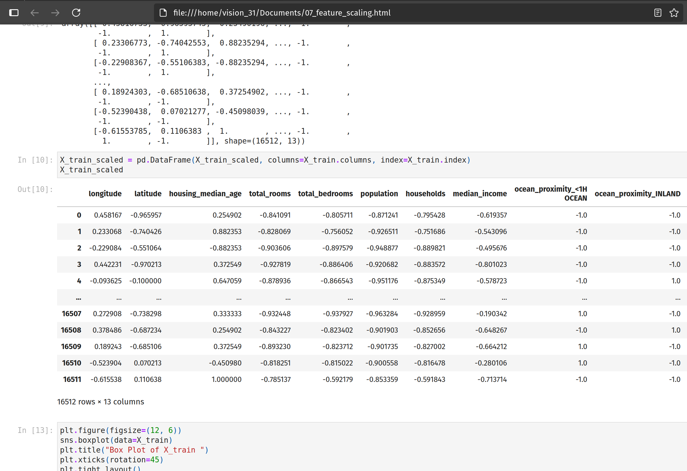
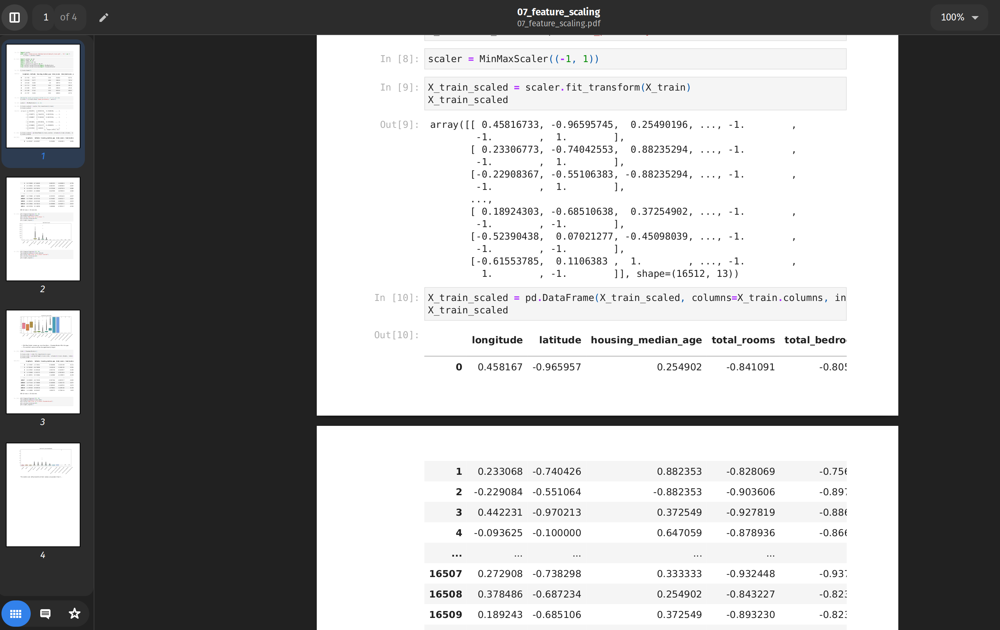

# Notebook to PDF Converter (v0.1)

Convert exported Jupyter Notebook HTML files into clean A4 PDFs with preserved styling.

## Features

- Uses Playwright + Chromium for faithful rendering.
- Preserves background colors, code formatting, and outputs.
- Input: place your exported `.html` in `./notebooks`.
- Output: PDF saved in `./pdfs`.

## Example Transformation

Here’s proof that the script does what it says:

| **Input (exported HTML)** | **Output (generated PDF)** |
|:------------------:|:------------------:|
|  |  |

<!-- **Input (exported HTML):**


**Output (generated PDF):**
 -->

## Project Structure

.
├── src/main.py
├── notebooks/   # put your .html here
├── pdfs/        # PDF output
|-- docs/        # Example Transformation
└── .gitignore

## Usage

```bash
pip install -r requirements.txt
playwright install chromium
python converter.py
